# School District Analysis

## Overview of the School District Analysis

### Original Analysis

This work is dedicated to analyze data on student funding and students' standardized test scores of math and reading. The analysis is based on provided data containing a file with schools with their budget and a file with students of each school with their math and reading scores. We've got the schools' performance as a result of the analysis.

### Updated Analysis

We've been notified by the school board that the file with students' scores shows evidence of academic dishonesty - reading and math grades for Thomas High School (THS) ninth graders appear to have been altered. These scores were removed from the updated analysis while keeping the rest of the data intact.

## Results

To remove altered scores we used `loc` method with conditions for created earlier DataFrame as per below example:

```
student_data_df.loc[(student_data_df["school_name"] == "Thomas High School") & (student_data_df["grade"] == "9th"),["reading_score"]] = np.nan

student_data_df.loc[(student_data_df["school_name"] == "Thomas High School") & (student_data_df["grade"] == "9th"),["math_score"]] = np.nan
```

Let's see how changing the THS 9th grade students scores to NaN affected summary school analysis.

- How is the district summary affected?

    On the below provided screenshots we can see that district summary results were almost not affected - average scores and percentage of passing scores dropped slightly but the difference is only tenths of percent which is not critical:

    ***District Summary (original results)***

    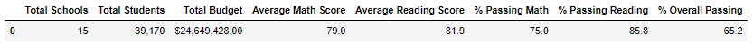

    ***District Summary (updated results)***

    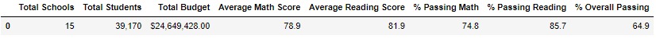

- How is the school summary affected?
    
    First let's see original school summary results:

    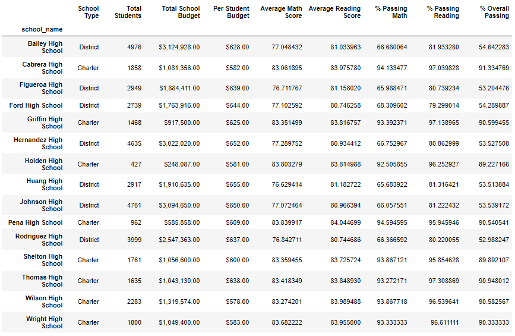

    Using `loc` method we can take a look on THS summary only:

    ```
    per_school_summary_df.loc[["Thomas High School"]]
    ```
    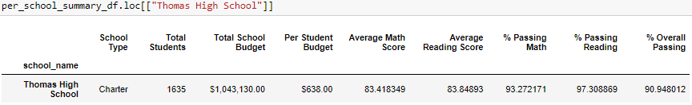

    After just removing altered scores we will get below results for THS:

    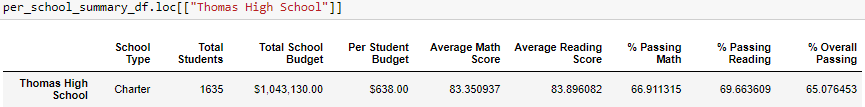

    We can see that average math and reading scores changed but not critical. This is because `mean()` function doesn't include NaN results by default. But passing math, reading and overall passing percentage results are decreased significantly. This happened because we calculated percentage using `per_school_counts` variable that equals to the count of all students in the school - including 9th grade:

    ```
    # Calculate the number of students passing math and passing reading by school.

    per_school_passing_math = per_school_passing_math.groupby(["school_name"]).count()["student_name"]

    per_school_passing_reading = per_school_passing_reading.groupby(["school_name"]).count()["student_name"]

    # Calculate the percentage of passing math and reading scores per school.

    per_school_passing_math = per_school_passing_math / per_school_counts * 100

    per_school_passing_reading = per_school_passing_reading / per_school_counts * 100
    ```
    To remove this huge changing we need to correct percentage calculations for THS, dividing not by the total count of students but by count of 10th - 12th graders only. After that we can replace final percentages for THS in the school summary DataFrame:

    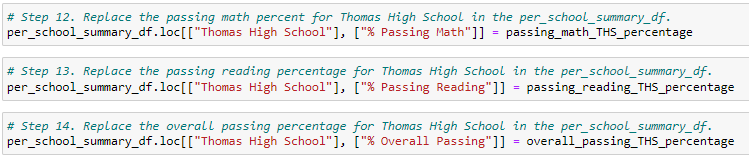

    Average math score dropped a little bit - means that 9th grade students had higher average math scores than other grades students and removing their scores from the analysis caused this decrease on updated results.

    On the other hand, average reading score slightly increased - means that 9th grade students had lower average reading scores than other grades students.
    
    Passing math, reading and overall passing percentage results for Thomas High School decreased on updated results but after corrected calculations at an acceptable level. 

    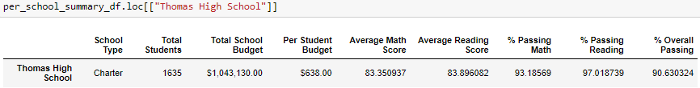

    Changing grades for THS students didn't affect other school results:

    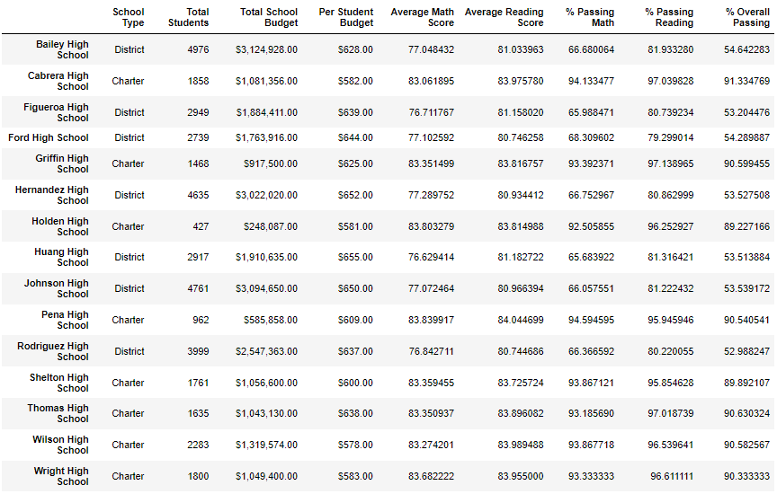

- How does replacing the ninth graders’ math and reading scores affect Thomas High School’s performance relative to the other schools?

    As per above screenshots we can see that replacing the 9th grade students scores from THS decreased their overall passing percentage from original 90.95% to updated 90.63%. But per checking top-5 performing schools it didn't change overall picture - THS is still on the 2nd place. Since scores changing affected only THS results bottom-5 performing schools picture didn't change as well:

    ***High permorming schools (original results):***

    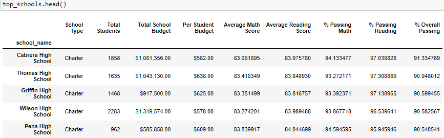

    ***High permorming schools (updated results):***

    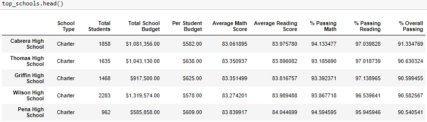

    ***Low permorming schools (original results):***

    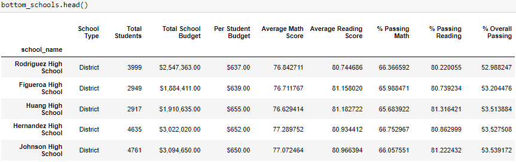

    ***Low permorming schools (updated results):***

    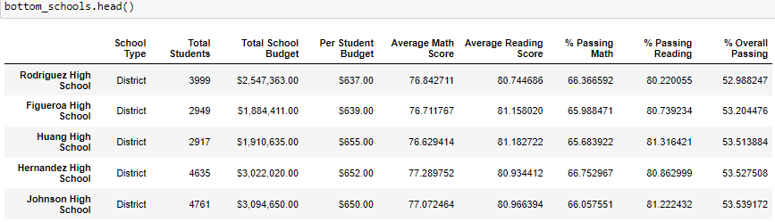

- How does replacing the ninth-grade scores affect the following:
    - Math and reading scores by grade

        The only difference that we can see for math scores is that for THS 9th grade shows NaN on updated results:

        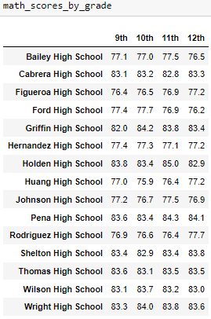
        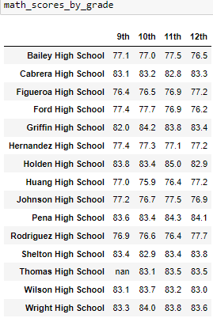

        The same is for reading scores - THS 9th grade shows NaN and other schools / grades were not affected:

        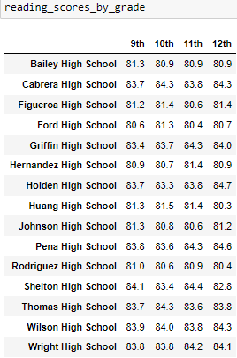
        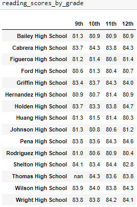

    - Scores by school spending

        To get scores grouped by spending ranges we created spending bins with `group_names` as labels:

        ```
        # Establish the spending bins and group names.

        spending_bins = [0, 585, 630, 645, 675]

        group_names = ["<$584", "$585-629", "$630-644", "$645-675"]

        # Categorize spending based on the bins.

        per_school_summary_df["Spending Ranges (Per Student)"] = pd.cut(per_school_capita, spending_bins, labels=group_names)
        ```

        Since THS's per student budget is $638 - this school falls under $630-644 spending range. We can see slightly difference in updated results exactly for this spending range:

        ***Spending Ranges (Per Student) (original results):***

        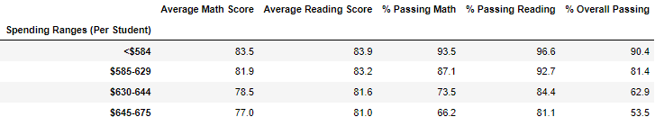

        ***Spending Ranges (Per Student) (updated results):***

        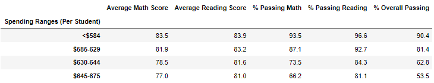

    - Scores by school size

        We can see slightly change for a Medium school size group (1000-2000) where THS belongs (with total of 1635 students):

        ***School Size (original results):***

        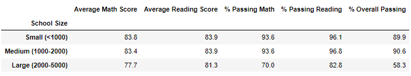

        ***School Size (updated results):***

        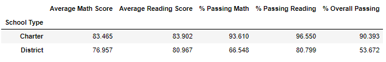

    - Scores by school type

        THS is a Charter School, so we can see slightly changes for Charter only school type. These differences are so small that I have to change formatting to show thousandths:

        ***School Type (original results):***

        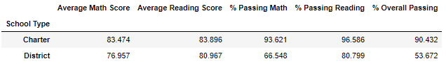

        ***School Type (updated results):***
        
        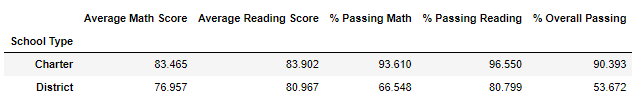
    
## Summary

Changing reading and math scores for the ninth grade at THS to NaNs didn't affect any other school results except of THS which is correct. It is interesting that though overall passing percentage decreased for THS from original 90.95% to updated 90.63% THS is still on the second place of top-performing schools.

But we can see changes for those categories where THS belongs, for example:

1. Scores by school spending - we can see changes for only a $630-644 range since THS's per student budget is $638.
2. Scores by school size - we can see changes for only Medium size group (1000-2000) since THS has overall 1635 students.
3. Scores by school type - we can see changes for only Charter school type since THS is a Charter school.
4. District Summary - we can see that all score results changed that was affected by replacing THS 9th grade students' scores.
